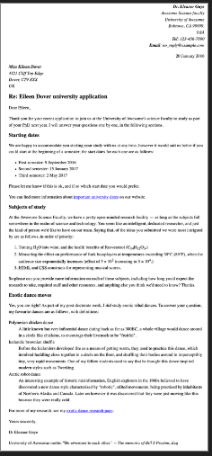

Example

The following screenshot shows an example of what the letter might look like after being marked up.

https://developer.mozilla.org/en-US/docs/Learn/HTML/Introduction_to_HTML/Marking_up_a_letter